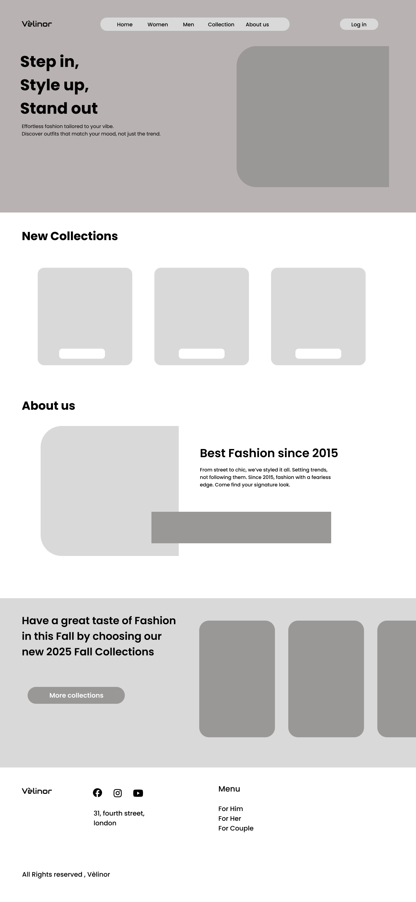

# Task 1 - Low-Fidelity Wireframe (Fashion Brand Landing Page)

This is a low-fidelity wireframe designed for a fashion brand website called **Vélinor**. The purpose of this wireframe is to outline the basic structure and layout of the landing page before moving to high-fidelity design or development.

---

## 📌 Key Sections:

✅ **Navigation Bar**  
Includes links to main pages like Home, Women, Men, Collection, About Us, along with a Login button.

✅ **Hero Section**  
Prominent headline with supporting text to attract the user, accompanied by space for a featured image.

✅ **New Collections**  
Grid layout showcasing the latest product collections.

✅ **About Us**  
Brief brand story with accompanying image area, highlighting the fashion journey since 2015.

✅ **Promotional Banner**  
Call-to-action section introducing the Fall 2025 Collection with space for promotional images.

✅ **Footer**  
Includes brand logo, social media icons, address, and quick links for Men, Women, and Couple collections.

---

## 🎨 Preview:

---

## 💡 Tools Used:
- Figma (Low-fidelity Wireframe Creation)

---

